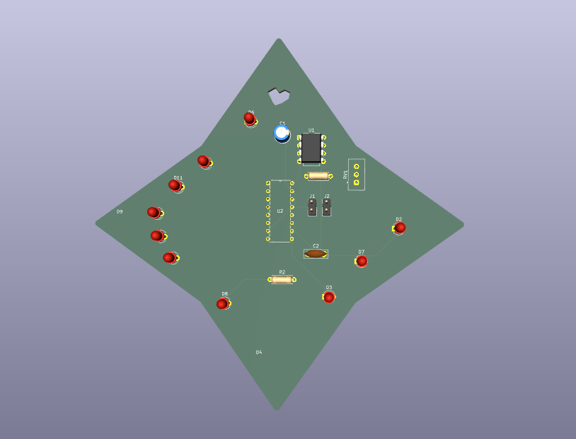

# BlinkyBoard
KiCad Blinky Board in the shape of a diamond!
There is also a drawn heart in the PCB to add a small personal touch to it.

BOM:

<<<<<<< HEAD

Here's the BOM with components (also named BOMwithcomponents in the git)

=======

 This is a cool blinky board I made inspired by the stars!! It features a star shape along with a mini cut out heart. I started to build my first PCB, and definitely learned that! I leearned so much about KiCad, even from a simple project like this; I learned about footprints, schematics vs. pcb, and how to wire on a board! I loved making this project, it taught me a lot of the fundamentals for KiCad and I'm excited to build it
